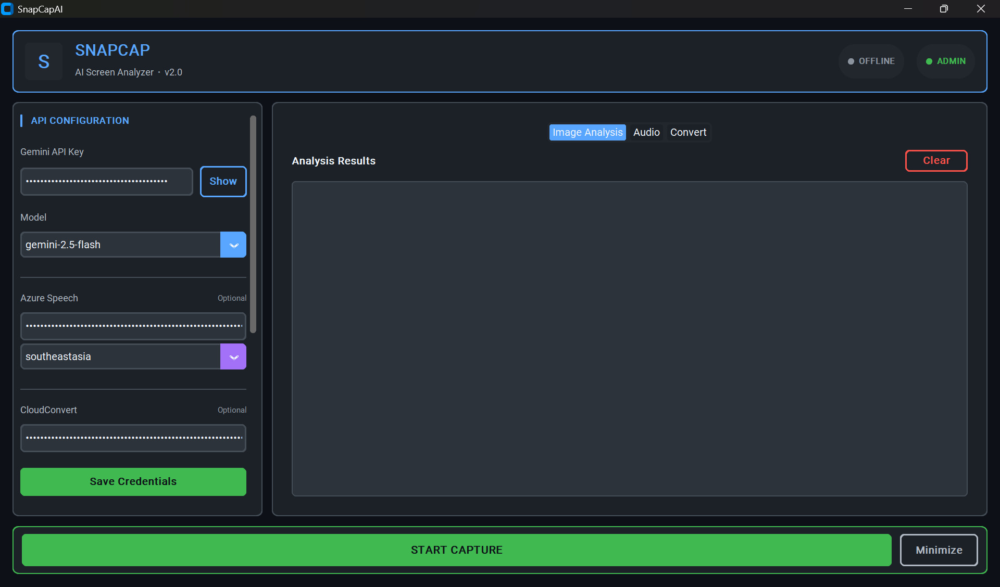

# 🤖 SnapCapAI

**AI-Powered Screen Capture with Stealth Mode**



Chụp màn hình bằng PrtSc và phân tích bằng AI mà không làm gián đoạn ứng dụng đang chạy (browser, game, video).

---

## ⚠️ Lưu ý quan trọng (18/01/2026)

> **Cập nhật API Migration (v2.1.0)**
> 
> - ✅ Migrated từ `google.generativeai` (deprecated) sang `google-genai` (v1.59.0)
> - ✅ Loại bỏ FutureWarning cảnh báo deprecation
> - ✅ UI Redesign: Cyber Liquid Glass theme với GitHub-inspired colors
> - ✅ Tối ưu contrast và layout (1100x700 window)
>
> **Google Free Tier - `gemini-2.5-flash`:**
> | Loại | Giới hạn |
> |------|----------|
> | RPM (Request/phút) | **5 requests** |
> | TPM (Token/phút) | **250,000 tokens** |
> | RPD (Request/ngày) | **25 requests** |

---

## ✨ Tính năng

### 🕵️ Stealth Mode
- Hook keyboard cấp thấp (WH_KEYBOARD_LL)
- Nuốt phím PrtSc - Browser/Game không biết bạn đã chụp
- Yêu cầu quyền Administrator

### 🎯 HUD Overlay Notification
- Thông báo TopMost không chiếm focus (WS_EX_NOACTIVATE + WS_EX_TRANSPARENT)
- Click-through - Không ảnh hưởng thao tác
- 2 theme: ⬜ White (dim text) / ⬛ Dark
- Tùy chỉnh duration: 1-10 giây
- **Width notification 600px** - Hiển thị rõ ràng hơn

### 📸 Batch Capture
- Chụp nhiều ảnh liên tiếp (tối đa 10 ảnh)
- Debounce 5 giây - Reset timer mỗi lần chụp
- Tự động gộp và gửi tất cả ảnh sau 5s không hoạt động
- **Smart Context** - AI phân tích liên kết giữa các ảnh

### 🖱️ Double-Click Controls (0.5s threshold)
| Thao tác | Chức năng |
|----------|-----------|
| **Double-click LEFT** | Hiện notification cuối cùng từ history |
| **Double-click RIGHT** | Ẩn notification ngay lập tức |

- **Chỉ hoạt động khi Stealth Mode BẬT** - Tắt khi dừng capture
- Phát hiện trên **button release** (không phải press) - Tránh nhầm với hold
- **Notification History** - Lưu tối đa 10 kết quả gần nhất
- Bảo mật - Người khác không thấy kết quả ngay lập tức

### 🤖 AI Analysis
- Google Gemini API (2.5-flash mặc định)
- **6 Prompt Templates** tối ưu:
  - 📝 General Analysis
  - 🔍 Code Review  
  - ✅ Answer Questions
  - 📄 Text Extraction (OCR)
  - 🔐 Explain Technical
  - 🌐 Translate (Việt ↔ English)
- Prompt tùy chỉnh hoặc dùng template
- **Hot-switch model** khi đang chạy (không cần restart)

### 🎤 Audio Transcription (Tùy chọn)
- Azure Speech-to-Text
- Ghi âm trực tiếp hoặc upload file
- Transcribe realtime từ microphone

### 🔄 File Converter (Tùy chọn)
- 49+ định dạng qua CloudConvert API
- Hỗ trợ: Audio, Image, Document, Video

---

## 🚀 Cài đặt

### Yêu cầu hệ thống
- Windows 10/11
- Python 3.10+ (khuyến nghị 3.12+)
- Quyền Administrator (cho Stealth Mode)

### Cài đặt nhanh

```powershell
# Clone repository
git clone https://github.com/QuangNew/SnapCapAI.git
cd SnapCapAI

# Install dependencies
pip install -r requirements.txt

# Chạy ứng dụng (tự động yêu cầu quyền Admin)
python gui_app.py
```

---

## 🔑 Cấu hình API Keys

| Service | Bắt buộc | Ghi chú | Link |
|---------|----------|---------|------|
| **Gemini** | ✅ | Free tier chỉ có 2.5-flash | [aistudio.google.com](https://aistudio.google.com/app/apikey) |
| Azure Speech | ❌ | Cho audio transcription | [portal.azure.com](https://portal.azure.com) |
| CloudConvert | ❌ | Cho file conversion | [cloudconvert.com](https://cloudconvert.com/dashboard/api/v2/keys) |

---

## 🎮 Cách sử dụng

### Cơ bản
1. Nhập Gemini API Key → **Save All Credentials**
2. Chọn model: `gemini-2.5-flash` (khuyến nghị cho free tier)
3. Click **"▶ ENGAGE STEALTH MODE"**
4. Nhấn **PrtSc** để chụp ảnh
5. Chờ 5s hoặc chụp thêm (tối đa 10 ảnh)
6. AI tự động phân tích và hiện kết quả

### 🖱️ Điều khiển Notification
| Thao tác | Chức năng |
|----------|-----------|
| **Double-click LEFT** (0.5s) | Hiện lại notification cuối cùng |
| **Double-click RIGHT** (0.5s) | Ẩn notification ngay lập tức |
| Tự động | Notification tự ẩn sau duration đã set |

### Chế độ hoạt động
| Trạng thái | Màu | Mô tả |
|------------|-----|-------|
| 👑 Admin Mode | 🟢 Xanh | Stealth Mode đầy đủ, PrtSc bị nuốt |
| ⚠️ Standard Mode | 🟡 Vàng | Fallback (pynput), có thể bị detect |

### Tùy chỉnh Notification
- **Theme:** ⬜ White / ⬛ Dark (dim text cho stealth)
- **Duration:** 1s - 10s
- **Width:** 600px (hiển thị rõ ràng)

---

## 🔧 Build EXE

Tạo file thực thi (.exe) để sử dụng không cần Python:

```powershell
# Cách 1: Batch file (khuyến nghị)
.\setup-and-build.bat

# Cách 2: Build thủ công
pip install pyinstaller
pyinstaller SnapCapAI.spec --clean
```

**Output**: `dist\SnapCapAI.exe`

---

## 📁 Cấu trúc Project

```
SnapCapAI/
├── gui_app.py               # Main application
├── keyboard_hook_manager.py # Low-level keyboard hook (WH_KEYBOARD_LL)
├── hud_notification.py      # HUD overlay (WS_EX_NOACTIVATE)
├── resource_manager.py      # Context managers, SafeFileWriter
├── audio_handler.py         # Azure Speech integration
├── cloudconvert_handler.py  # CloudConvert API wrapper
├── universal_converter.py   # Multi-format converter
├── config.json              # Saved settings & API keys
├── requirements.txt         # Python dependencies
├── SnapCapAI.spec           # PyInstaller spec
└── temp/                    # Output folders
    ├── audio/
    ├── image/
    ├── document/
    ├── video/
    └── speechtotext_output/
```

---

## ❓ Xử lý sự cố

| Vấn đề | Nguyên nhân | Giải pháp |
|--------|-------------|-----------|
| PrtSc không detect | Không có quyền Admin | Right-click → Run as Administrator |
| "429 Quota exceeded" | Hết quota free tier | Chờ reset (1 phút cho RPM, 24h cho RPD) |
| "429 Rate limit" | Gửi quá 5 request/phút | Chờ 1 phút rồi thử lại |
| HUD chiếm focus | Bug Windows cũ | Restart app, kiểm tra Windows 10/11 |
| API Error | Key sai hoặc hết hạn | Kiểm tra lại API key |
| FutureWarning (deprecated API) | Phiên bản cũ | Cập nhật `google-genai` v1.59.0+ |
| Double-click không nhận | Giữ nút quá lâu | Click nhanh 2 lần trong 0.5s |
| Notification bị chồng | Bug cũ (đã fix) | Cập nhật code mới nhất |

---

## 🔄 Changelog

### v2.1.0 (18/01/2026)
- ✅ **API Migration** - Migrated từ `google.generativeai` sang `google-genai` v1.59.0
- ✅ **Loại bỏ FutureWarning** - Cảnh báo deprecation không còn
- ✅ **UI Redesign** - Cyber Liquid Glass theme với GitHub-inspired colors
- ✅ **Improved UI/UX** - Better contrast, optimized window size (1100x700)
- ✅ **Color Scheme** - Bright text (#f0f6fc), readable secondary (#b1bac4), GitHub blues/greens

### v1.4.0 (15/12/2025)
- ✅ **Double-click chỉ hoạt động khi capture BẬT** - Tắt khi dừng capture
- ✅ **Memory leak fix** - Clear batch screenshots và pending results khi stop
- ✅ **Tối ưu import** - Move `time` import ra top-level (tránh import lặp mỗi 30ms)
- ✅ **Giữ temp files** - Không xóa files trong temp khi đóng app

### v1.3.0 (14/12/2025)
- ✅ **Notification History** - Lưu 10 kết quả gần nhất
- ✅ **Double-click LEFT** (0.5s) - Hiện lại notification cuối
- ✅ **Double-click RIGHT** (0.5s) - Ẩn notification ngay
- ✅ **Smart button release detection** - Tránh nhầm hold với double-click
- ✅ **Notification overlap fix** - Không còn chồng lên nhau
- ✅ **Wider notification** - 600px width cho dễ đọc
- ✅ **6 Optimized prompts** - Template chi tiết hơn
- ✅ **Thread-safe batch timer** - Fix bug 5s debounce

### v1.2.0 (13/12/2025)
- ✅ Hot-switch model khi đang chạy
- ✅ Mặc định `gemini-2.5-flash` (free tier compatible)
- ✅ Batch capture (5s debounce, max 10 ảnh)
- ✅ Double-click to reveal results
- ✅ Notification theme & duration settings

### v1.1.0
- ✅ HUD Notification với click-through
- ✅ Stealth Mode với keyboard hook
- ✅ Admin auto-elevation

### v1.0.0
- 🚀 Initial release

---

## 📜 License

MIT License - Free to use and modify.

---

## 👨‍💻 Tác giả

**Built with ❤️ by QuangNew | January 2026**
